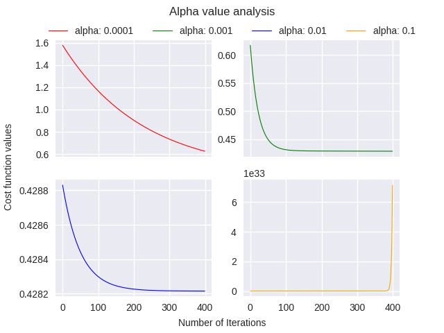

# Multivariate-Linear-Regression
Multivariate Linear Regression using Gradient Descent and Normal equation method.

## Dataset Description:
### URL: 
https://www.kaggle.com/harlfoxem/housesalesprediction

### Features: 
19 house features plus the price and the id columns, along with 21613 observations.

### Features used:
Target value: Price 
Features: Square Feet of plot, bedrooms, floors 

### Description: 
This dataset contains house sale prices for King County, which includes Seattle. It includes homes sold between May 2014 and May 2015.

## Graph:

 
For different values of alpha - respective cost function variation.

## Normal Equation Method
theta = (inv(X'X))X'y

where, 
<ul>
	<li>inv(X) : Inverse of X</li>
	<li>X' : X Transpose</li>
</ul>